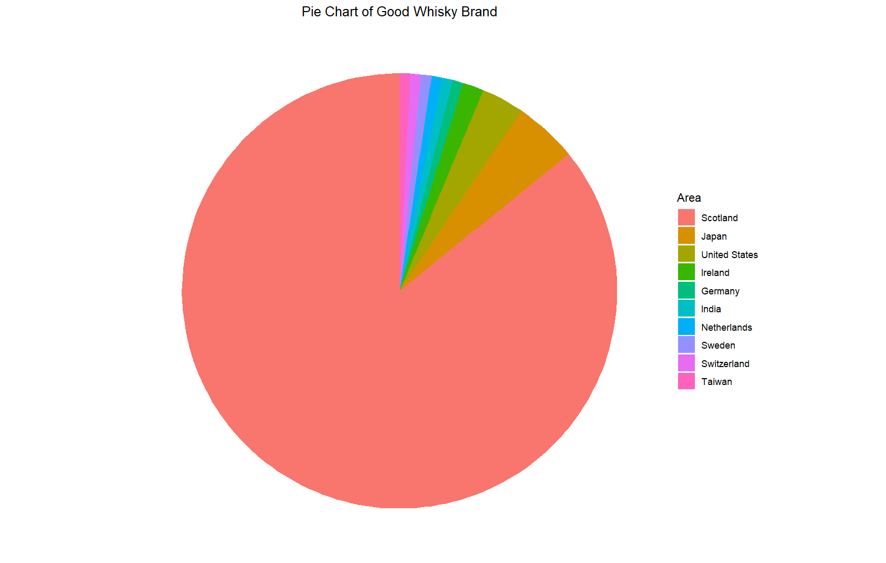
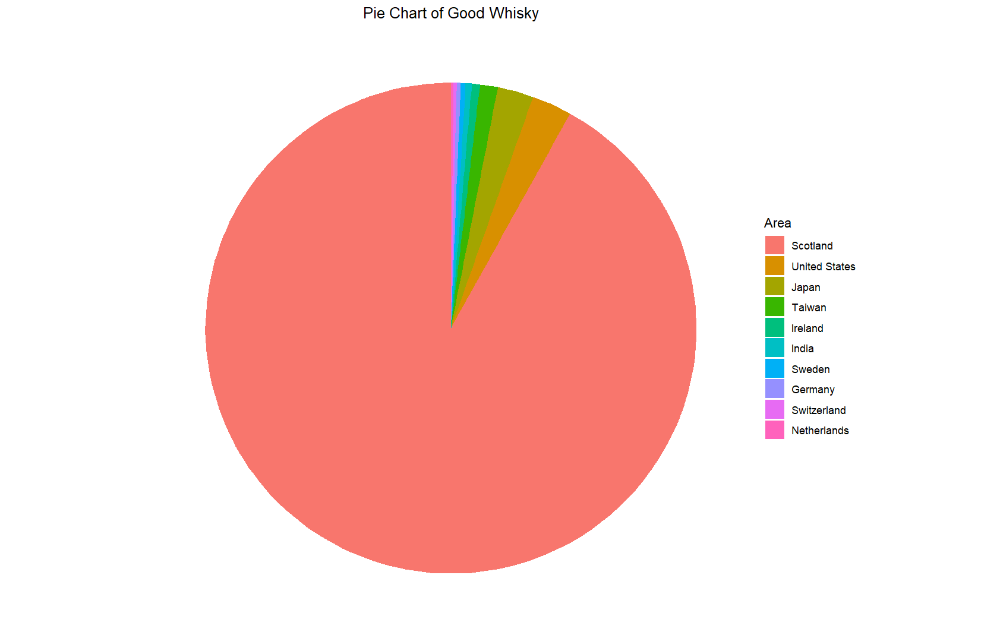
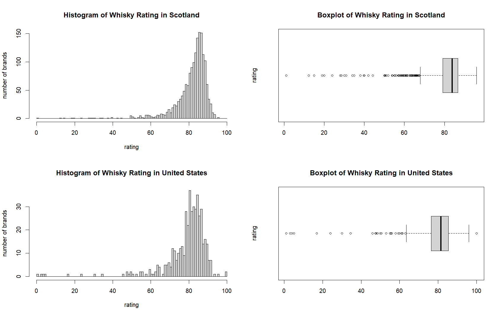

# Report of Data Analytics Term Project
##### Chenyi Huang 2024/8/8

## Project Define
- My data set is about the brands of whisky in the world and their origin area, rating, ranking, etc. The data set is from `https://www.kaggle.com/datasets/koki25ando/world-whisky-distilleries-brands-dataset?select=Whisky_Brand.csv`, and the original source is `https://www.whiskybase.com/`.
- These dataset have 4880 observations in it. I have cleaned up the data, removed empty columns and fix some csv format problems, but I won't reduce the size of the data set since my laptop is able to process these data.
-
  | Column Name | Description                                                              |
  | ----------- | ------------------------------------------------------------------------ |
  | Brand       | The brand or the company name of whisky                                  |
  | Area        | Where the whisky factory located                                         |
  | Whiskies    | How many kinds of whisky this brand made                                 |
  | Votes       | How many people voted or commented this brand on the whisky base website |
  | Rating      | The average score of this brand from the whisky base website             |
  | WB.Ranking  | The grade evaluated by whisky base website                               |

## Research Questions
- Question 1
  - Which place have the largest amount of whisky brands?
  - Which place have the largest amount of good whisky brands?
    - The reference indicators of 'good' is: there are more than 100 people vote for this whisky on the whiskybase website and have a ranking higher than D. 
    <br/><br/>
    
    ```
    goodBrandData <- brandData %>% 
        filter(WB.Ranking != "G", WB.Ranking != "F", WB.Ranking != "E", Votes >= 100)

    numOfBrandByArea <- brandData %>% 
        filter(Area != "") %>%
        group_by(Area) %>%
        summarise(NumOfBrand = n()) %>%
        arrange(desc(NumOfBrand))

    numOfGoodBrandByArea <- goodBrandData %>% 
        filter(Area != "") %>%
        group_by(Area) %>%
        summarise(NumOfGoodBrand = n()) %>%
        arrange(desc(NumOfGoodBrand)) %>%
        mutate(Area = factor(Area, levels = Area))

    ggplot(numOfGoodBrandByArea, aes(x = "", y = NumOfGoodBrand, fill = Area)) +
        geom_bar(width = 1, stat = "identity") +
        coord_polar(theta = "y") +
        labs(title = "Pie Chart of Good Whisky Brand", fill = "Area") +
        theme_void() +
        theme(plot.title = element_text(hjust = 0.5))
    ```
  - Result: 
    - The top 5 places of the amount of brands are `Scotland`, `United States`, `Germany`, `Ireland` and `Canada`. 
    - But the top 5 places of the amount of good brands are `Scotland`, `Japan`, `United States`, `Ireland` and `Germany`. For Canada, only 3 of the 112 brands from it are good.

  - Pie Chart:
  
    
    


- Question 2
  - What is the regional distribution of making good whiskey? 
    - The number of making whisky is the sum of how many whisky the brands in this area made. For example, the brand `Talisker` made `544` kind of whiskies, that will be add into the number of making whisky in Scotland.
    - Current Expectation: The top whisky making place might be Scotland, Japan, or the USA.
    <br/><br/>
    
    ```
    numOfGoodWhiskyByArea <- goodBrandData %>% 
        filter(Area != "") %>%
        group_by(Area) %>%
        summarise(NumOfWhisky = sum(Whiskies, na.rm = TRUE)) %>%
        arrange(desc(NumOfWhisky)) %>%
        mutate(Area = factor(Area, levels = Area))

    ggplot(numOfGoodWhiskyByArea, aes(x = "", y = NumOfWhisky, fill = Area)) +
        geom_bar(width = 1, stat = "identity") +
        coord_polar(theta = "y") +
        labs(title = "Pie Chart of Good Whisky", fill = "Area") +
        theme_void() +
        theme(plot.title = element_text(hjust = 0.5))
    ```

  - Result:
      - The top 5 places of the amount of good whisky are `Scotland`, `United States`, `Japan`, `Taiwan` and `Ireland`. It's very surprised that Taiwan is in this list since there are only two brands in Taiwan, `Kavalan` and `Nantou`, and they're both very good.

  - Pie Chart:
  
    


- Question 3
  - What is the distribution of the rating of Scotish and US whisky brands? 
    - Current Expectation: The data is approximately normally distributed but left-skewed.
    <br/><br/>
    
    ```
    par(mfrow = c(2,2))

    whiskyInScotland <- brandData %>% filter(Area == "Scotland")
    hist(whiskyInScotland$Rating, breaks = seq(0, 100, by=1), main = "Histogram of Whisky Rating in Scotland", xlab = "rating", ylab = "number of brands")
    boxplot(whiskyInScotland$Rating, main = "Boxplot of Whisky Rating in Scotland", ylab = "rating", horizontal = TRUE)

    whiskyInUS <- brandData %>% filter(Area == "United States")
    hist(whiskyInUS$Rating, breaks = seq(0, 100, by=1), main = "Histogram of Whisky Rating in United States", xlab = "rating", ylab = "number of brands")
    boxplot(whiskyInUS$Rating, main = "Boxplot of Whisky Rating in United States", ylab = "rating", horizontal = TRUE)
    ```

  - Result:
      - The data is approximately normally distributed but left-skewed. It means that the quality of Scotish and American whisky is good so the ratings are about 70 to 100.

  - Histogram and Boxplot:
  
    


- Question 4
  - Whether or not the mean of the rating of Scotish whisky is greater than the US?
  - We do a Two-Sample Test
    - Step 1: Set up the hypotheses and select the alpha level
  
      - $H_0: \mu_1 = \mu_2$ (the mean whisky rating are the same)
      - $H_1: \mu_1 > \mu_2$ (the mean whisky rating are greater in Scotland)
      - $\alpha = 0.05$
    - Step 2: Select the appropriate test statistic
      - since n is big, we use one-sided two-sample z-test:
        $z = \frac{(\bar{x_1}-\bar{x_2})}{\sqrt{\frac{\sigma_1^2}{n_1}+\frac{\sigma_2^2}{n_2}}}$ 
    - Step 3: State the decision rule
      - Determine the appropriate critical value from the standard normal distribution table associated with a right hand tail probability of $\alpha = 0.05$. Using the table, the appropriate critical value is 1.6449.
      - Decision Rule: Reject $H_0$ if $|z| > 1.6449$, Otherwise, do not reject $H_0$.
    - Step 4: Compute the test statistic and the associated p-value

        ```
        whiskyInScotland <- whiskyInScotland %>% filter(!is.na(Rating))
        whiskyInUS <- whiskyInUS %>% filter(!is.na(Rating))

        n1 = nrow(whiskyInScotland)
        n2 = nrow(whiskyInUS)

        zCriticalValue = qnorm(1 - 0.05)

        xbar1 = mean(whiskyInScotland$Rating)
        xbar2 = mean(whiskyInUS$Rating)
        sd1 = sd(whiskyInScotland$Rating)
        sd2 = sd(whiskyInUS$Rating)
        z = (xbar1 - xbar2)/sqrt((sd1^2/n1 + sd2^2/n2))
        pValue = pnorm(z)
        ```

        $z = 4.4477$    
        $p = 0.999996$
    - Step 5: Conclusion
      - Reject $H_0$ since $|z| = |4.4477| > 1.6449$
      - We have significant evidence at the $\alpha = 0.05$ level that $\mu_1 > \mu_2$
      - We reject the null hypothesis the mean whisky rating of Scotland and the US are the same in favor of the alternative hypothesis that the mean whisky rating are greater in Scotland than the US ($p = 0.999996$).

  - Result:
      - The mean of the rating of Scotish whisky is greater than the US.


## References
- https://www.kaggle.com/datasets/koki25ando/world-whisky-distilleries-brands-dataset?select=Whisky_Brand.csv
- https://www.whiskybase.com/